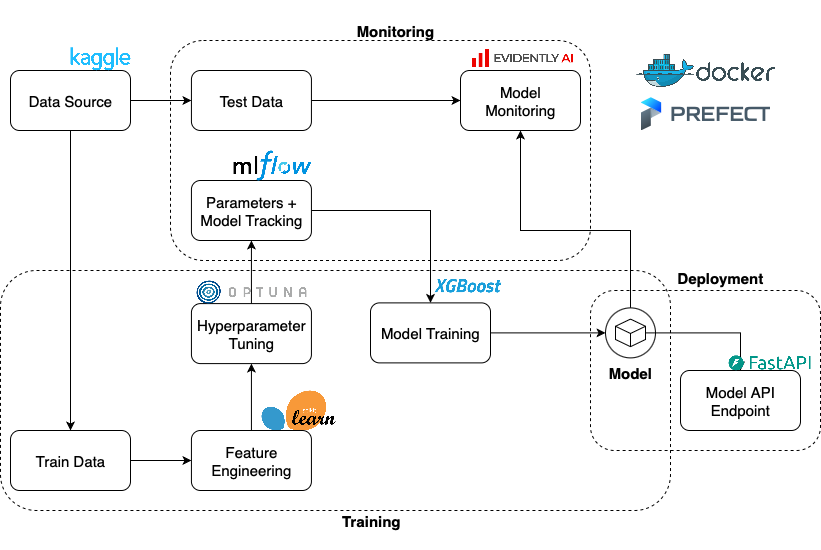

# About this repo
This is a repository for showcasing an end-to-end bank customer churn prediction pipeline. Please refer to [PRD.md](docs/PRD.md)

# Features


- Model Development
  - Jupyter Notebook for exploratory data analysis.
  - Scikit-learn for standardized feature engineering.
  - Xgboost for standard fast, efficient and scalable model.
  - Bayesisan optimization hyperparameter tuning with Optuna.
  - Pytest suite covers data I/O, preprocessing, training/tuning, monitoring glue, and API surfaces.
- Model Evaluation
  - Standard training and holdout datasets to simulate real-world data distribution.
  - MLFlow for detailed experiment tracking and enabling comparison of experiment runs, visualizations and SHAP explanatory plots.
- Model Deployment
  - The models are versioned in MLFlow Model Registry with metadata and dependencies for transparency.
  - FastAPI service loads the latest registered preprocessor/model from MLflow and exposes endpoint for serving.
- Model Monitoring
  - Evidently for automated data drift and prediction performance report
  - Grafana for dashboard visualization of model metrics

# Geting Started
## Prerequisites
- Python >= 3.10, <3.13
- Docker
- Pixi (optional)

## Installation
Multiple package manager can be used to install the dependencies (from `pyproject.toml`) but pixi is used for this demo.
```bash
# pixi (Recommended)
pixi install

# pip
pip install -e .

# uv
uv pip install
```

Make sure that you have the dataset downloaded
```bash
make data-up
```
## Usage
### Docker
```bash
# Start services
make docker-up

# Run a training flow for model creation
# Example
python main_flow.py --data-path data/Customer-Churn-Records.csv
```
Create a sample request `sample_payload.json`:
```
{
    "instances": [
        {
        "Geography": "France",
        "Gender": "Female",
        "NumOfProducts": 2,
        "HasCrCard": 1,
        "IsActiveMember": 1,
        "Satisfaction Score": 4,
        "Card Type": "Gold",
        "CreditScore": 650,
        "Age": 42,
        "Tenure": 5,
        "Balance": 12345.67,
        "EstimatedSalary": 80000.0,
        "Point Earned": 100.0
        }
    ]
}
```
Invoke a POST request:
```bash
curl -s -X POST http://localhost:8001/predict -H 'Content-Type: application/json' --data @sample_payload.json
```

Further details can be looked up at [DOCKER.md](docs/DOCKER.md)
