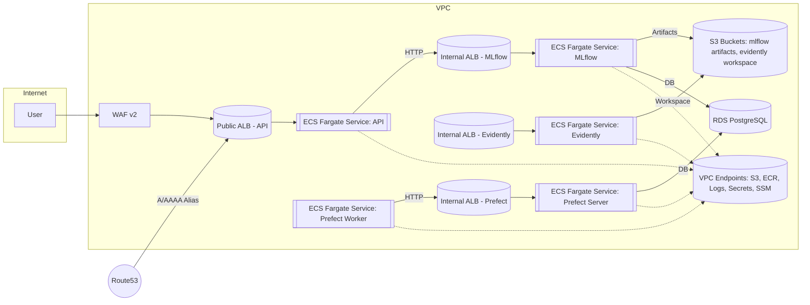

# AWS Migration Plan for Docker Compose Stack (No Kubernetes)

This document maps the current Docker Compose-based stack to AWS fully managed services and outlines a practical, step-by-step migration plan. It covers networking, IAM, secrets, observability, risks, and cost/scalability/security considerations.

## 1) Current Infrastructure Overview

Compose files: `infra/docker-compose.yaml`, `infra/backend.yaml`, `infra/prefect.yaml`

Services and dependencies:
- MLflow Tracking Server (`mlflow_tracking_server`)
  - Backend: Postgres (`mlflow_db`)
  - Artifacts: S3-compatible MinIO (`s3` + bucket init jobs)
  - Exposes port 5000
- FastAPI Inference API (`api`)
  - Depends on MLflow (`MLFLOW_TRACKING_URI`)
  - Exposes port 8001
- Evidently Service (`evidently`)
  - Stores workspace on S3-compatible storage
  - Exposes port 8000
- Grafana (`grafana`)
  - Uses Postgres (`grafana_db`) and file-based provisioning for datasources/dashboards
  - Exposes port 3000
- Adminer (`adminer`)
  - DB admin UI on port 8080 (developer convenience only)
- MinIO (`s3`) with two init jobs (`minio_create_bucket`, `evidently_create_bucket`)
- Prefect Server (`prefect-server`) with Postgres (`prefect_db`)

## 2) Service-to-AWS Managed Service Mapping

- MinIO (`s3`) → Amazon S3 (replace entirely)
- Bucket init jobs → IaC (CloudFormation/CDK/Terraform) or one-off CLI to create S3 buckets/policies
- `mlflow_db`, `grafana_db`, `prefect_db` (Postgres) → Amazon RDS for PostgreSQL or Aurora PostgreSQL (Aurora Serverless v2 if spiky)
- `mlflow_tracking_server` → Amazon ECS Fargate service (in private subnets) + internal ALB; backend store in RDS; artifacts in S3
- `api` (FastAPI) → Amazon ECS Fargate service + public ALB (or App Runner if preferred for simplicity)
- `evidently` → Amazon ECS Fargate service + internal ALB; workspace in S3
- `grafana`
  - Preferred: Amazon Managed Grafana (AMG)
  - Alternate: ECS Fargate + RDS Postgres
- `adminer` → Avoid in production; use RDS Query Editor v2 or SSM Session Manager/bastion for DB access
- Optional replatforming:
  - Prefect: Prefer Prefect Cloud or AWS Step Functions + EventBridge (if willing to migrate orchestration)

Note: This migration plan implements Prefect self-hosted on ECS for both the server and worker.

## 2a) Architecture Diagram (High-Level)



## 3) Step-by-Step Migration Actions

### Phase A — Foundations
1. Accounts and baseline
   - Use separate AWS accounts per env (dev/stage/prod). Set up AWS SSO/IAM Identity Center.
   - Enable CloudTrail org trails, GuardDuty, Security Hub, AWS Config.
2. Networking (VPC)
   - Create VPC with 3 AZs.
   - Public subnets for ALB; private subnets for ECS tasks and RDS.
   - NAT Gateways per AZ (or 1 in dev), and VPC endpoints: S3 Gateway; Interface for ECR, CloudWatch Logs, Secrets Manager, SSM, X-Ray.
3. KMS
   - CMKs for S3, RDS, Secrets, CloudWatch Logs. Define key policies and grants for least privilege.

### Phase B — Storage (Replace MinIO)
1. Create S3 buckets
   - `mlflow-artifacts-<env>-<acct>` (versioning on, SSE-KMS, lifecycle to IA/Glacier),
   - `evidently-workspace-<env>-<acct>` (same settings),
   - Optional: access logs bucket.
2. Policies and protection
   - Block Public Access, enforce TLS, require encryption by bucket policy; enable object lock (if compliance needed).
3. Data migration
   - From MinIO to S3 using `mc mirror` or an ephemeral job: `mc mirror minio/<src-bucket> s3/<dest-bucket>`.
   - Verify checksums and object counts.

### Phase C — Databases
1. Provision RDS PostgreSQL (or Aurora PG)
   - Engine: PostgreSQL 14+; Multi-AZ; storage autoscaling; backups (7–35 days); Enhanced Monitoring.
   - Security group: allow inbound only from ECS tasks’ SG. Place in private subnets.
2. Secrets
   - Store DB credentials in Secrets Manager with rotation, or use RDS IAM Auth.
3. Data migration
   - Export from local Postgres: `pg_dump -Fc -h <old> -U <user> <db> > dump.dump`
   - Import to RDS: `pg_restore -h <rds-endpoint> -U <user> -d <db> -c dump.dump`
   - Validate schemas and app connectivity.

### Phase D — Container Images and Registries
1. Create ECR repositories: `mlflow`, `api`, `evidently` (and `grafana` if self-hosting).
2. Build and push images from CI: login to ECR, tag, and push per env.

### Phase E — Compute on ECS Fargate
1. ECS Cluster
   - Create ECS cluster with Fargate/Fargate Spot capacity providers; prefer Graviton (arm64) images if compatible.
2. Task definitions (per service)
   - Execution role: ECR pull, CloudWatch Logs write.
   - Task role: least-privilege access (S3 bucket/prefix, Secrets read, RDS connect if using IAM Auth).
   - Logging: CloudWatch Logs (per-service log groups, retention 30–90 days).
   - Health checks and container ports as in Compose.
3. Services + Load Balancing
   - MLflow: internal ALB (HTTPS via ACM on private hosted zone) → target ECS service.
   - API: public ALB (HTTPS) → target ECS service. Health path `/health` (or `/`).
   - Evidently: internal ALB; optional access via VPN/Client VPN/PrivateLink.
   - Prefect server: internal ALB; `prefect server start` with DB creds from Secrets.
   - Prefect worker: ECS service (no LB) connecting to `http://<prefect-internal-alb>/api`.
4. Networking
   - Place tasks in private subnets, SG allows ingress only from relevant ALB SGs.
   - RDS SG allows ingress only from ECS tasks SG.
   - S3 access via VPC endpoint (no NAT for S3 traffic).

### Phase F — Prefect and Grafana
1. Prefect on ECS (server + worker)
   - Prefect server: Fargate service, private subnets, internal ALB on port 80 → container 4200.
   - Env: `PREFECT_API_DATABASE_CONNECTION_URL=postgresql+asyncpg://<user>:<pass>@<host>:5432/<db>` via Secrets + env.
   - Prefect worker: Fargate service without ALB; `PREFECT_API_URL=http://<prefect-alb-dns>/api`; scale desiredCount for throughput.
2. Grafana
   - Preferred: Amazon Managed Grafana (AMG) with CloudWatch data source; enable SSO and workspace.
   - If self-hosting: ECS Fargate + RDS for Grafana DB; secure behind internal ALB.

### Phase G — IAM and Secrets
1. IAM task roles (examples)
   - `mlflow-task-role`: S3 read/write to artifacts bucket; Secrets read for DB creds.
   - `api-task-role`: S3 read if needed; Secrets read for MLflow URI or other secrets.
   - `evidently-task-role`: S3 read/write to workspace bucket.
2. Policies restricted by resource ARNs and prefixes; condition keys for TLS and VPC endpoints.
3. Secrets Manager for DB creds and app secrets; SSM Parameter Store for non-sensitive config.

### Phase H — Observability
1. Logging: CloudWatch Logs with retention; structure logs (JSON if possible).
2. Metrics/Alarms: ALB 5xx/latency, ECS CPU/mem/task failures, RDS CPU/connections/storage, S3 4xx/5xx.
3. Tracing: AWS X-Ray or ADOT for FastAPI.
4. Audit: CloudTrail, GuardDuty; AWS Config rules for encryption and public access.
5. Dashboards: Amazon Managed Grafana + CloudWatch data source; import or recreate dashboards from `infra/dashboards`.
6. WAF: Monitor blocked/allowed counts; tune managed rule groups and add IP rate limiting as needed.

### Phase I — CI/CD and IaC
1. Infrastructure as Code: CDK/CloudFormation/Terraform to manage VPC, RDS, S3, ECS, ALBs, IAM, Logs.
2. CI/CD: GitHub Actions with OIDC (`aws-actions/configure-aws-credentials`), build to ECR, deploy ECS via CDK or CloudFormation.
3. Environments: Separate stacks per env; promote images with tags or image digests.
4. ECR: Build and push `api`, `mlflow`, `evidently` images (tags aligned with task definitions, e.g., `latest`).

### Phase J — Cutover
1. Freeze writes (if any), final `pg_dump/pg_restore` and `mc mirror` to S3.
2. Deploy ECS services; smoke test internal and public endpoints.
3. Switch DNS to ALB; monitor metrics/alarms.
4. Decommission Docker/MinIO once stable.

## 4) Config and Code Changes
- Remove MinIO-specific env vars (e.g., `MLFLOW_S3_ENDPOINT_URL`, MinIO access keys). Use native S3 and IAM roles.
- Set `MLFLOW_TRACKING_URI` to the internal ALB/Cloud Map DNS instead of `http://mlflow_server:5000`.
- For Evidently, replace `FSSPEC_S3_ENDPOINT_URL` with native S3 configuration.
- Grafana: move from file provisioning to AMG APIs/workspace config (or keep provisioning if self-hosted on ECS).
- Prefect: update server/API URLs if self-hosted; or migrate to Prefect Cloud / Step Functions.

## 5) Risks, Trade-offs, Challenges
- MLflow has no AWS-managed equivalent → continued patching/upgrades on ECS.
- Prefect replatforming to Step Functions may require flow redesign (dynamic mapping, retries, Python-native logic differences).
- Grafana AMG changes provisioning model and licensing for enterprise plugins; self-hosting increases ops overhead.
- Data migration: ensure MLflow `artifact_uri` values are S3-native and not MinIO-specific; validate object/path compatibility.
- NAT costs and egress: prefer VPC endpoints; restrict egress.
- Public exposure: secure the public API with WAF, rate limiting, and auth; keep MLflow/Evidently internal-only.
- Fargate ephemeral storage: ensure container temp storage needs fit (or increase ephemeral storage in task def).

## 6) Cost Optimization
- Compute
  - Use Graviton (arm64) images for ECS; consider Fargate Spot for non-critical services.
  - Right-size task CPU/mem and ALB count (shared ALB with multiple listeners/paths where possible).
- Databases
  - Start small (RDS t-series or Aurora Serverless v2 with autoscaling); use RI/Savings Plans for steady-state.
- Storage/Logs
  - S3 lifecycle to IA/Glacier; S3 Intelligent-Tiering for unknown patterns.
  - CloudWatch Logs retention (30–90 days), filter noisy logs.
- Networking
  - Use VPC endpoints to reduce NAT traffic; minimize cross-AZ data transfer.
  - Add S3 Gateway and Interface endpoints (ECR, ECR Docker, CloudWatch Logs, Secrets Manager, SSM) for private egress.
- Managed services
  - Prefer AMG over self-hosted Grafana for low admin overhead; evaluate user-based pricing vs EC2/RDS costs.
  - Use WAF managed rule sets to reduce cost of bespoke security tooling.

## 7) Scalability and Reliability
- ECS Service Autoscaling on CPU/mem/ALB request count; multiple AZs.
- RDS: Multi-AZ, storage autoscaling; Aurora read replicas if needed.
- S3: elastic scaling, consider multipart uploads for large artifacts.
- Health checks and circuit breakers on ECS; ALB failover across AZs.
- Backups and DR: RDS automated backups + periodic snapshots; S3 versioning and optional cross-region replication.
 - Prefect workers: autoscale on queue depth/CPU; multiple workers across AZs for resilience.

## 8) Security Hardening
- Network: ECS/RDS in private subnets; only ALB public (for API). Use Security Groups with least privilege.
- TLS: ACM certs; enforce HTTPS on ALBs; optional AWS WAF for public API.
- IAM: least-privilege task roles; resource- and prefix-scoped S3 access; condition keys for TLS/VPC endpoints.
- Secrets: Secrets Manager with rotation; no secrets in images or env vars committed to code.
- Admin tools: Replace `adminer` with RDS Query Editor v2 or SSM tunnels; never expose DBs publicly.
- Compliance: CloudTrail, GuardDuty, Config rules; KMS CMKs for data at rest.
 - Prefect services: keep internal-only; restrict access via VPN/Client VPN; IAM-restrict secrets access to task roles.
 - Public API: attach AWS WAF v2 with managed rules; use ACM certificates on HTTPS listeners and redirect 80→443.

## 9) Quick Mapping Reference
- `mlflow_tracking_server` → ECS Fargate (private) + internal ALB, RDS (PG), S3
- `api` → ECS Fargate (public) + ALB, depends on MLflow and S3
- `evidently` → ECS Fargate (private) + internal ALB, S3
- `s3` (MinIO) → Amazon S3
- `mlflow_db`, `grafana_db`, `prefect_db` → RDS PostgreSQL / Aurora PG
- `grafana` → Amazon Managed Grafana (preferred) or ECS + RDS
- `adminer` → RDS Query Editor v2 / SSM
- `minio_create_bucket`, `evidently_create_bucket` → IaC/CLI for S3 buckets
 - `prefect-server` → ECS Fargate (private) + internal ALB, RDS (PG)
 - `prefect-worker` → ECS Fargate (no LB), connects to Prefect server

## 10) CDK Implementation Notes (New)
- VPC Endpoints stack included: S3 Gateway + Interface endpoints (ECR, ECR Docker, CloudWatch Logs, Secrets Manager, SSM) to reduce NAT costs and keep traffic private.
- ECS Fargate services defined and wired to ALBs:
  - MLflow (internal ALB, S3 artifacts, RDS backend via Secrets)
  - API (public ALB, forwards to container port 8001; uses MLflow internal DNS)
  - Evidently (internal ALB, S3 workspace path)
  - Prefect server (internal ALB, DB via Secrets)
  - Prefect worker (no LB; connects to server internal ALB)
- ECR repositories are created for `api`, `mlflow`, and `evidently`; push your images and keep tags in sync (default `latest`).
- Public API ALB can run HTTPS with ACM cert if context `apiDomain`, `hostedZoneName`, `hostedZoneId` are supplied.
- AWS WAF v2 (regional) attached to API ALB with AWSManagedRulesCommonRuleSet; extend as needed.
- DB init Fargate task definitions included for creating `mlflow` and `prefect` databases (run via `aws ecs run-task`).

## 11) Operational Runbooks (New)
- Build and push images to ECR (api/mlflow/evidently).
- Run DB init tasks to create `mlflow` and `prefect` databases on RDS.
- If HTTPS desired: provide domain context, verify ACM DNS validation, and update Route53 aliases to the API ALB.

---

## Appendix A — Example IAM Policies

Task role for MLflow (restrict to artifacts bucket/prefix):
```json
{
  "Version": "2012-10-17",
  "Statement": [
    {
      "Effect": "Allow",
      "Action": [
        "s3:PutObject",
        "s3:GetObject",
        "s3:DeleteObject",
        "s3:ListBucket"
      ],
      "Resource": [
        "arn:aws:s3:::mlflow-artifacts-<env>-<acct>",
        "arn:aws:s3:::mlflow-artifacts-<env>-<acct>/*"
      ]
    },
    {
      "Effect": "Allow",
      "Action": [
        "secretsmanager:GetSecretValue"
      ],
      "Resource": "arn:aws:secretsmanager:<region>:<acct>:secret:mlflow-db-*"
    }
  ]
}
```

Bucket policy to enforce TLS and encryption:
```json
{
  "Version": "2012-10-17",
  "Statement": [
    {
      "Sid": "DenyNonTLS",
      "Effect": "Deny",
      "Principal": "*",
      "Action": "s3:*",
      "Resource": [
        "arn:aws:s3:::mlflow-artifacts-<env>-<acct>",
        "arn:aws:s3:::mlflow-artifacts-<env>-<acct>/*"
      ],
      "Condition": {"Bool": {"aws:SecureTransport": "false"}}
    },
    {
      "Sid": "DenyUnEncryptedUploads",
      "Effect": "Deny",
      "Principal": "*",
      "Action": "s3:PutObject",
      "Resource": "arn:aws:s3:::mlflow-artifacts-<env>-<acct>/*",
      "Condition": {"StringNotEquals": {"s3:x-amz-server-side-encryption": "aws:kms"}}
    }
  ]
}
```

## Appendix B — Example ECS Task Snippets

Environment and secrets (CDK/CloudFormation conceptual example):
```json
{
  "containerDefinitions": [
    {
      "name": "mlflow",
      "image": "<acct>.dkr.ecr.<region>.amazonaws.com/mlflow:<tag>",
      "portMappings": [{"containerPort": 5000}],
      "logConfiguration": {"logDriver": "awslogs", "options": {"awslogs-group": "/ecs/mlflow", "awslogs-region": "<region>", "awslogs-stream-prefix": "ecs"}},
      "environment": [
        {"name": "MLFLOW_S3_IGNORE_TLS", "value": "true"}
      ],
      "secrets": [
        {"name": "MLFLOW_DB_URI", "valueFrom": "arn:aws:secretsmanager:<region>:<acct>:secret:mlflow-db-URI"}
      ]
    }
  ]
}
```

## Appendix C — Data Migration Commands

- MinIO to S3 (using `mc`):
```bash
mc alias set minio http://<minio-host>:9000 <access-key> <secret-key>
mc mirror minio/<source-bucket> s3/<dest-bucket>
```

- Postgres dump/restore:
```bash
pg_dump -Fc -h <old-host> -U <user> <db> > dump.dump
pg_restore -h <rds-endpoint> -U <user> -d <db> -c dump.dump
```

## Appendix D — Observability Alarms (Examples)
- ALB: Target 5xx > 1% for 5 min; high latency p95 > N ms.
- ECS: Service running task count < desired; CPU > 80% or Mem > 80% for 10 min.
- RDS: CPU > 80%, free storage < 20%, max connections nearing limit.
- S3: 4xx/5xx anomalies via CloudWatch metrics or S3 Storage Lens.

## Appendix E — Alternative Choices
- API on App Runner instead of ECS for simpler ops (consider cold starts, VPC egress, and pricing trade-offs).
- Aurora PostgreSQL Serverless v2 for spiky workloads.
- Replace self-hosted Prefect with Step Functions + EventBridge where feasible.
```
