## Architecture

### Prefect Orchestration

- Purpose: Orchestrate the training and evaluation workflow with retries, logging, and observability.
- Design: Prefect server with PostgreSQL backing; UI to inspect flows, tasks, and runs.
- Implementation: Flow defined in Python; UI accessible once the `prefect` service is up.
- Endpoint: `http://localhost:4200`.

The main Prefect flow `churn_flow()` orchestrates the following tasks:
1. **load_data**: Reads CSV and splits into train/val/test (60/20/20)
2. **preprocess**: Fits preprocessor on train, transforms train/val, registers preprocessor to MLflow
3. **hyperparameter_tuning**: Runs Optuna study with XGBoost for N trials, logs runs to MLflow
4. **train_model**: Trains final model with best params on train+val, registers to MLflow
5. **load_registered_artifacts**: Loads latest preprocessor and model from MLflow registry
6. **run_evaluation**: Generates SHAP explanations and logs to MLflow
7. **create_drift_report**: Creates Evidently report comparing train vs test data, uploads to Evidently
8. **grafana_monitor**: Extracts metrics from Evidently report and writes to Postgres for Grafana

Visual: Prefect flow graph showing task dependencies and execution timeline.

  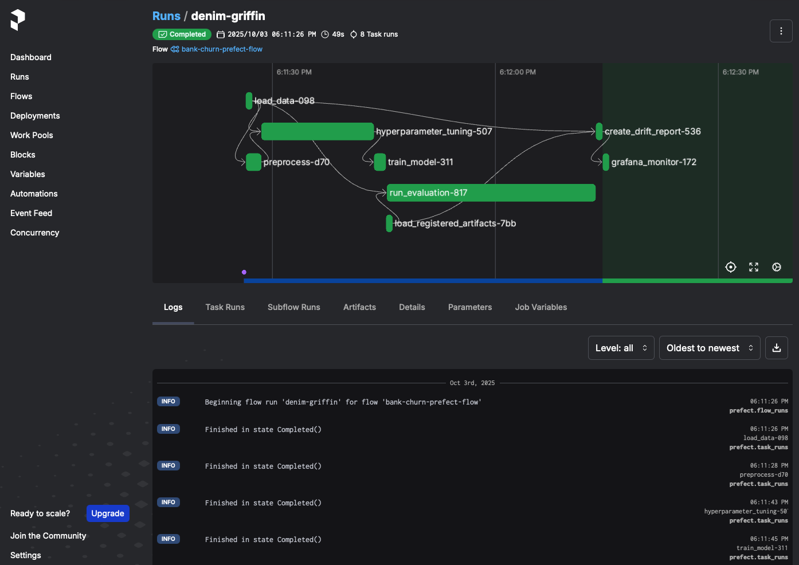
   
  <em>Prefect DAG view showing task dependencies and timing.</em>

### Scikit-learn Feature Engineering

**Dropped columns**: `RowNumber`, `CustomerId`, `Surname`, `Complain`

**Categorical features** (OneHotEncoded):
- Geography, Gender, NumOfProducts, HasCrCard, IsActiveMember, Satisfaction Score, Card Type

**Numerical features** (StandardScaled):
- CreditScore, Age, Tenure, Balance, EstimatedSalary, Point Earned

**Target**: `Exited` (binary: 0=stayed, 1=churned)

### Optuna

- Purpose: Optimize XGBoost hyperparameters for churn classification while balancing bias/variance.
- Objective & Direction: Maximizes validation F1; logs `f1_score` and `roc_auc` to MLflow per trial.
- Sampler & Reproducibility: TPE sampler with a fixed seed for deterministic search.
- Search Space: Tunes `n_estimators`, `learning_rate`, `reg_lambda`, `reg_alpha`, `subsample`, `max_depth`, `max_delta_step`, `min_child_weight`, `gamma`, `scale_pos_weight` with log-scaling where appropriate.
- Early Stopping: Uses a validation set with `early_stopping_rounds=300` to stop unpromising trials.
- Trials & Tracking: Defaults to `NUM_TRIALS=200` (configurable) and runs each trial as a nested MLflow run; the parent run logs the best parameters with a date-stamped name.

### XGBoost Model Training

- Inputs: Preprocessed feature matrix and labels; uses the combined train and validation sets for final fitting.
- Algorithm: XGBoost trained via `xgboost.train` on an `xgboost.DMatrix` for efficiency.
- Parameters: Applies the Optuna-selected `best_params` from the tuning study to fit the final booster.
- Registration & Lineage: The flow logs and registers the trained model to MLflow under `XGB_MODEL_NAME`, and logs the training dataset for lineage.
- Inference: `make_predictions` transforms inputs with the registered preprocessor, scores with the XGBoost model, and converts scores to 0/1 labels via rounding and clipping.
- Reproducibility: A fixed seed is used throughout tuning and is included in model params to ensure deterministic behavior where possible.

### MLflow Tracking & Model Registry

- Purpose: Centralize experiment tracking, metrics/params/artifacts, and provide a versioned model registry.
- Design: Stateless server with a PostgreSQL backend for metadata and MinIO S3 for artifacts; served with `--serve-artifacts` for direct artifact access.
- Implementation: Defined in `infra/backend.yaml`; environment wired via `infra/config/config.env`.
- Endpoint: `http://localhost:5000` (UI); artifacts in `s3://{MLFLOW_BUCKET_NAME}` on MinIO.

  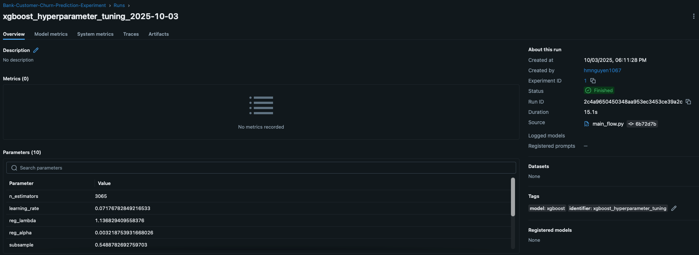
   
  <em>Best hyperparameters and metrics captured from Optuna-driven runs.</em>

  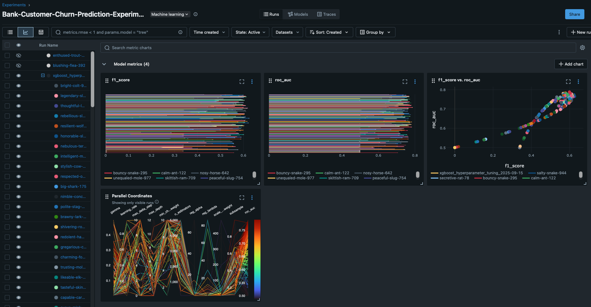
   
  <em>Side-by-side comparison of key metrics and params across runs.</em>

Two registered models:
- `ChurnDataPreprocessor`: Sklearn preprocessing pipeline
- `XGBoostChurnModel`: Trained XGBoost classifier

Both are versioned and loaded via `models:/{name}/latest` pattern.

  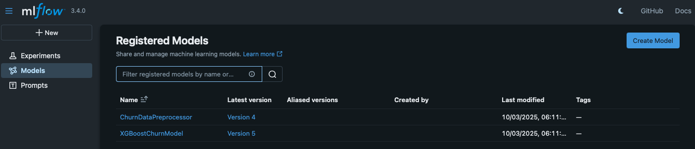
   
  <em>Registered models with versions and stages.</em>

### Model Monitoring (Evidently + Grafana)

- Evidently: Generates and stores data drift and data quality reports; writes a project workspace to MinIO via S3FS.
- Metrics Extraction: The flow extracts selected drift metrics from Evidently reports and writes them to PostgreSQL.

  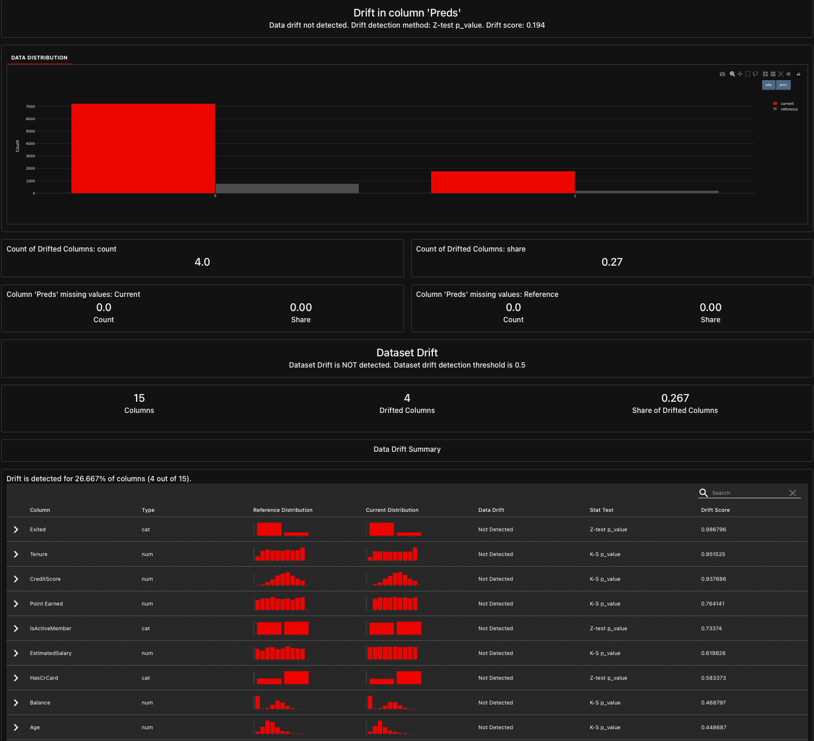
   
  <em>Evidently drift report comparing reference vs current data.</em>

- Grafana: Dashboards visualize these metrics from the Postgres datasource; provisioned via `infra/config` and `infra/dashboards`.

  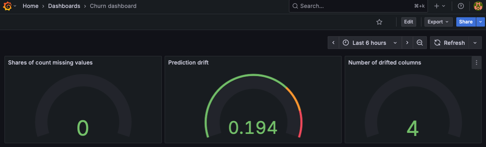
   
  <em>Grafana dashboard visualizing drift metrics from PostgreSQL.</em>

- Endpoints: Evidently `http://localhost:8000`, Grafana `http://localhost:3000`.

### FastAPI Inference

- Purpose: Serve batch/online predictions via simple HTTP endpoints.
- Design: Loads the latest registered preprocessor and model from MLflow at startup; exposes `/health`, `/ready`, `/metadata`, and `/predict`.
- Implementation: See `src/api` — `loader.py`, `inference.py`, and `schemas.py`.
- Endpoint: `http://localhost:8001`.

  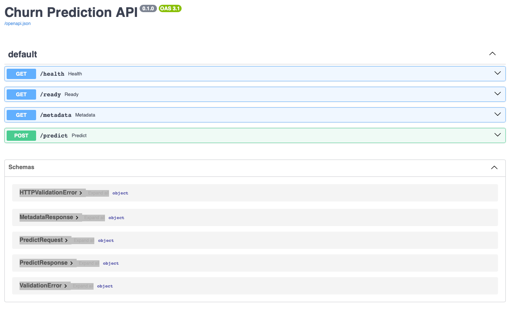
   
  <em>Interactive OpenAPI docs for health, readiness, metadata, and predict.</em>

### Model Evaluation & Explainability

- Logging: All plots are logged as MLflow artifacts during evaluation for reproducibility and review.
- Confusion Matrix: Shows correct vs. incorrect predictions by class. Diagonal cells are correct; off-diagonal indicate false positives/negatives. Useful to assess trade-offs (e.g., missing churners vs. flagging non-churners).

  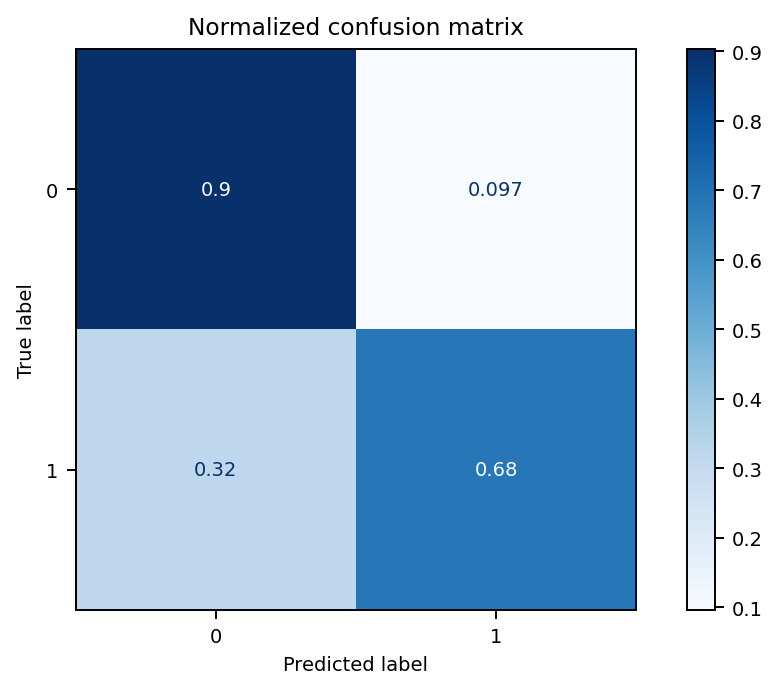
   
  <em>Confusion matrix for the final model on holdout data.</em>
  

- SHAP Feature Importance: Global view of which features most influence predictions, using mean absolute SHAP values across the dataset.

  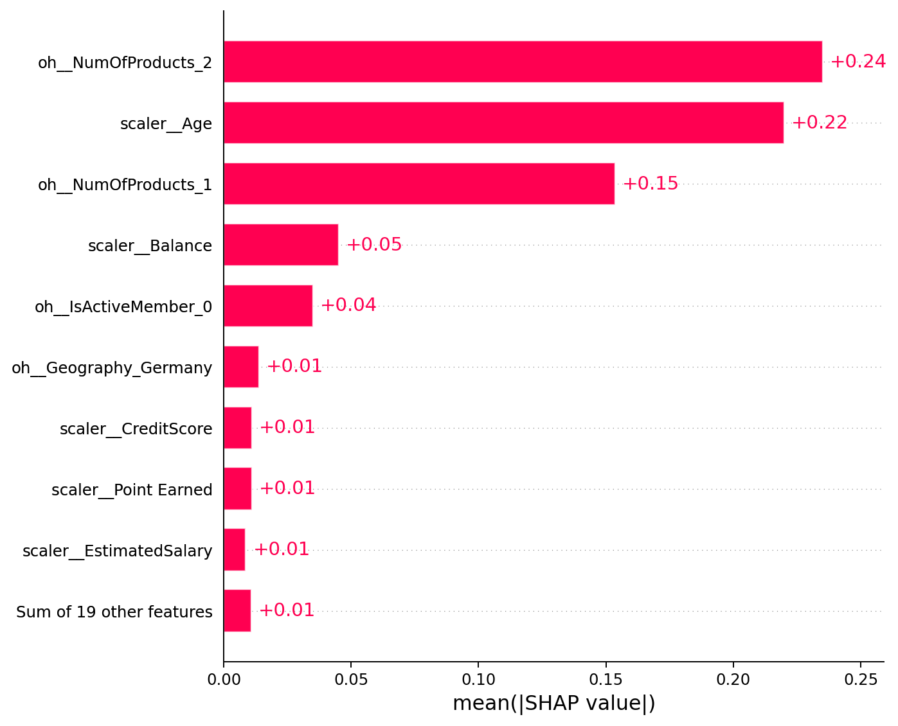
   
  <em>Mean absolute SHAP values indicating global feature importance.</em>
  

- SHAP Beeswarm: Per-sample distribution of SHAP values. Color encodes feature value; positive SHAP pushes toward churn, negative toward retention.

  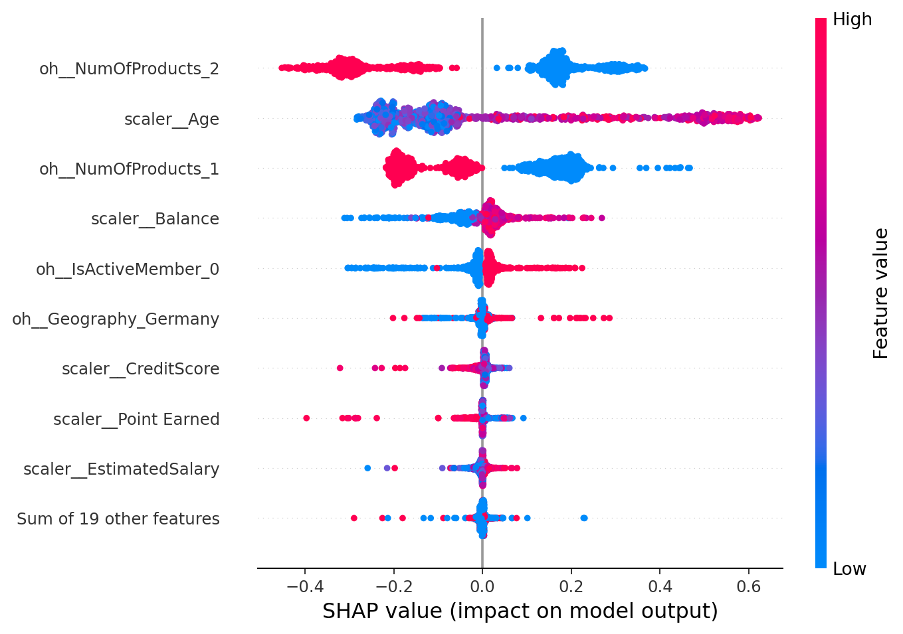
   
  <em>Beeswarm plot showing per-instance feature impacts.</em>
  

#### MinIO Object Storage (S3-Compatible)
- Purpose: Durable, S3-compatible storage for MLflow artifacts and Evidently workspace.
- Design: Single-node MinIO with console for bucket and object inspection; buckets auto-created at startup.
- Implementation: Buckets `${MLFLOW_BUCKET_NAME}` and `${EVIDENTLY_BUCKET_NAME}` are provisioned by helper jobs in Compose.
- Endpoints: API `http://localhost:9000`, Console `http://localhost:9001`.

  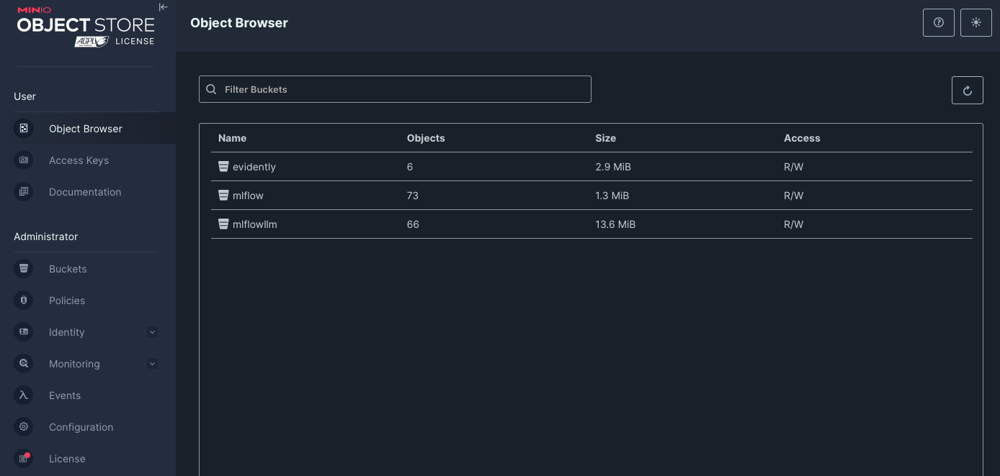
   
  <em>MinIO console showing buckets and stored artifacts.</em>

### Configuration

All services can be configured via `infra/config/config.env`:
- Service ports (MLflow, Prefect, API, databases)
- MinIO credentials and bucket names
- Database credentials
- See `docs/DOCKER.md` for full environment variables
